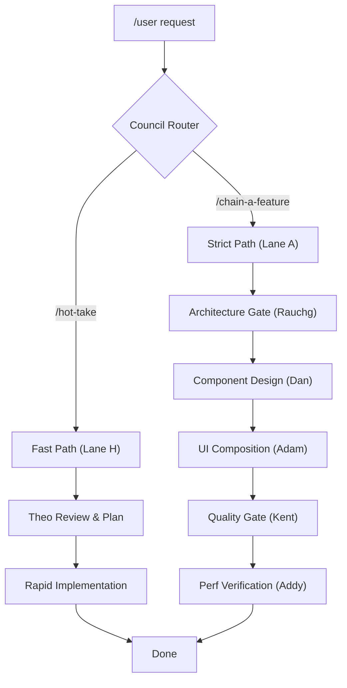

# 🏛️ Full-Stack Advisory Council

- **Welcome!**  
- Imagine walking into a boardroom where the world's best web developers, architects, and engineers are waiting to help you build your app. That’s exactly what the Full-Stack Advisory Council is — a team of **22 specialized AI personas** that work together like a real engineering crew.
- 
- ## What Is This Project?
- **Project Name:** Full-Stack Advisory Council  
- **Purpose:** A deterministic, multi-agent AI orchestration pipeline designed to architect, implement, review, and optimize full-stack web applications.
- 
- Instead of asking one generic AI to “build something,” you talk to a structured council. The experts hand work off to each other in clear steps so the final result is fast, secure, clean, and production-ready.
- 

## 🌌 Powered by Google Antigravity
This council only works inside **Google Antigravity** — a special AI-first development environment.

### What is Google Antigravity?
Normal code editors (like VS Code) make *you* type every line.  
Google Antigravity flips that: **AI agents** do the heavy lifting — they manage files, run terminal commands, search the web, and build features while you watch.

Here’s how it powers the Council:

- **🤖 Agent Manager (Mission Control)**: Spawns and coordinates the expert personas so they can actually edit your code and run commands.
- **🛡️ Secure Sandbox**: Uses kernel-level protection (Seatbelt, nsjail) so even if an AI makes a mistake, your real computer stays 100% safe.
- **🧠 Custom Brains**: Each persona is taught its exact job using simple Markdown rules and YAML files.

## 🪑 Meet the Council – 20+ Specialized Skills
The system automatically indexes and updates its own skill manifest using standard metadata. The council includes:

1. **Guillermo Rauch (Architecture)** — Plans the overall app structure and makes big technical decisions.
2. **Dan Abramov (React)** — Writes clean, modern React components and hooks.
3. **Adam Wathan (Tailwind CSS)** — Creates beautiful, responsive styling with Tailwind v4.
4. **Kent C. Dodds (Testing)** — Writes tests and checks accessibility (A11y).
5. **Addy Osmani (Performance)** — Fixes slow loading times and improves Core Web Vitals.
6. **Theo Browne (T3 Stack)** — Guides full-stack architecture and best practices.
7. **Gergely Orosz (Engineering Management)** — Helps with scaling, team decisions, and engineering excellence.
8. **Wes Bos (Educator)** — Teaches you step-by-step with friendly explanations.
9. **Ryan Dahl (Backend Runtime)** — Handles secure server-side code and runtime patterns.
10. **Pragmatic Librarian (Doc Audit)** — Audits code/doc sync and identifies semantic drift.
11. **Clover Verification Lead (Trifecta)** — Verifies functional correctness via Code vs Docstring vs Spec.
... and 11+ more specialized personas (Clerk, Stripe, Better Auth, Sentry) integrated into the master registry.

🚀 Slash Commands

### Chain Commands (multi-persona pipelines)

| Command | What happens |
| --- | --- |
| `/chain-a-feature` | **Build**: Architecture → React → Tailwind → Tests → CWV check (5 steps) |
| `/chain-b-review` | **Review**: React audit → TypeScript/DX → Tests/A11y → CSS audit (4 steps) |
| `/chain-c-architecture` | **Decide**: Trade-off analysis → Technical architecture → DX sanity check (3 steps) |
| `/chain-d-performance` | **Fix performance**: Baseline → Bundle reduction → LCP/INP/CLS branches → Regression gate (6 steps) |
| `/chain-e-teaching` | **Learn**: Working example → Tests → Styled UI, explained step-by-step (3 steps) |
| `/chain-f-security` | **Harden**: Threat model → Secrets audit → Auth → Data boundary → Security tests → Headers (6 steps) |
| `/chain-g-payments` | **Bill**: Strategy/Compliance → Technical Integration → Webhooks/Idempotency (3 steps) |
| `/chain-hot-take` | **Speed**: Theo Review → Rapid Implementation (2 steps) |

### Utility Commands

| Command | Purpose |
| --- | --- |
| `/resume` or `/resume [a-h]` | Resume a chain after closing mid-session — picks up from last complete Artifact |
| `/observe` | Show a summary of this session: chains run, skills invoked, Artifacts produced, halts, rule fires |
| `/doc-audit` | Digital Librarian: Scan project for documentation rot and semantic drift |
| `/trifecta` | Clover Verification Lead: Functional correctness (Trifecta) audit |
| `/chain-meta` | Self-Audit: framework health check for skills, router, governance, and blueprint integrity |

### Single-Skill Shortcuts (no chain overhead)

| Command | Persona |
| --- | --- |
| `/em-advice` | Gergely Orosz — EM/org/trade-off advice |
| `/tailwind` | Adam Wathan — Tailwind/CSS/design system |
| `/testing` | Kent C. Dodds — Tests and a11y |
| `/react` | Dan Abramov — React patterns and Hooks |
| `/trifecta` | Clover Verification Lead — Functional correctness audit |
| `/t3-review` | Theo Browne — T3 stack DX critique |

* * *

## 🛠️ Default Technology Stack

| Layer | Default |
| --- | --- |
| Framework | Next.js 15 (App Router, Server Components) |
| Language | TypeScript 5.x (strict) |
| Styling | Tailwind CSS v4 |
| API | tRPC or Server Actions |
| Validation | Zod (all runtime boundaries) |
| Database | Drizzle ORM + PostgreSQL |
| Auth | Better Auth or Clerk |
| Runtime | Edge-first; Node serverless for DB-heavy routes |
| Testing | RTL + MSW + Vitest (integration-first) |

Any layer can be overridden — just specify in your command.

* * *

## 🧠 How It Works (Architecture Overview)

The Full-Stack Advisory Council 2.0 operates on a **Source of Truth** principle — where the "Map" (documentation/artifacts) must always match the "Territory" (code).

### 1. Dual-Lane Orchestration

We support two distinct "Speeds" of development, ensuring high velocity for standard patterns while maintaining strict governance for complex architectural changes.

- **Strict Path (`/chain-a-feature`)**: The 5-step committee for complex architectural shifts, new features, or stack migrations.
- **Fast Path (`/hot-take`)**: 2-step pipeline (`Theo Review` -> `Implementation`) for rapid-firing standard T3 stack features.

### 2. Artifact Protocol 2.0 (Validated State)

Unlike generic AI assistants that carry "hidden context" in a chat memory, the Council uses **Artifacts as Validated State**. 

Every completed step writes a native Antigravity **Artifact**. The next persona reads the Artifact directly. However, in v2.0, every handoff is now **strictly typed**:
- **`kernel_schema` Enforcement**: Every skill has a YAML contract defining which K.E.R.N.E.L. sections it *must* produce.
- **Automated Validation**: The framework runs `validate-kernel.js` on every step. If an artifact misses a `Verify` block or a `Constraints Forward` section, the chain halts to prevent "metadata theater" and token waste.
- **Idempotency**: If a step's validated Artifact already exists and is complete, the step is skipped during `/resume`.

### 3. The K.E.R.N.E.L. Schema Protocol

All expert outputs follow the **K.E.R.N.E.L.** component model:
- **[K] Context**: Background/assumptions for the current step.
- **[E] Task**: The specific, single-goal action being taken.
- **[R] Constraints**: "Do not" rules and architectural boundaries.
- **[N] Format**: The exact output shape (diagrams, tables, code).
- **[E_V] Verify**: Concrete success criteria and CLI validation commands.
- **[L] Call to Action**: The explicit instruction for the *next* agent or the user.

### 4. Governance & Tech Debt Halt

Six priority rules (P0–P5) oversee every turn (see `GEMINI.md`). If a skill detects structural tech debt that blocks clean implementation, it emits a `[TECH DEBT]` block and triggers `/chain-c-architecture` to resolve the blocker before the feature chain continues.

* * *

## 📁 Workspace File Structure

    ~/.gemini/
      GEMINI.md                    ← Global config (cross-workspace)
    
    .agents/
      rules/
        observability.rule.md      ← P0.1: session logging
        verification.rule.md       ← P1: adversarial verifier
        context.rule.md            ← P2: context compression
        wizard.rule.md             ← P3: Artifact protocol
        anchors.rule.md            ← P4: word count constraints
        colleague.rule.md          ← P5: judgment > compliance
        predictive-routing.rule.md ← P6: predictive routing
    
      workflows/
        chains.json                ← Machine-readable chain registry
        fullstack-council.md       ← Master router (/fullstack-council)
        chain-a-feature.md         ← /chain-a-feature
        ...
        chain-hot-take.md          ← /hot-take
    
      scripts/
        registry-tool.js           ← Framework Health Check / Skill Registry
        validate-kernel.js         ← K.E.R.N.E.L. Schema Validator
    
      skills/
        [skill-name]/
          SKILL.md                 ← Persona behavior + kernel_schema
    
      session-log.md               ← Multi-turn orchestration log

* * *

## 🛡️ Security & Sandboxing

Google Antigravity uses OS-native kernel-level sandboxing — **not WSL2**:

* **macOS**: Seatbelt (`sandbox-exec`) kernel mechanism
* **Linux**: nsjail process isolation

When **Strict Mode** is enabled, network access is denied by default. The council's Strict Mode allowlist includes `pagespeed.web.dev` (performance chain), `vercel.com` (deploy verification), and `npmjs.com` (dependency resolution). The Browser subagent operates within the same allowlist.

* * *

## 🔁 Example Session

    You:    /chain-a-feature Add a dashboard with a data table and export to CSV
    
    [A1] rauchg-tech-lead-architect  → Architecture decision + Mermaid diagram
                                       → Artifact: a1-architecture ✓
    [A2] react-core-lead             → Component tree + Hooks strategy
                                       → Artifact: a2-components ✓
    [A3] adam-wathan-design-system   → Tailwind markup + design audit
                                       → Artifact: a3-ui ✓
    [A4] kent-dodds-quality-lead     → Integration tests + a11y audit
                                       → Artifact: a4-quality ✓
    [A5] optimizing-web-performance  → CWV projection + Lighthouse command
                                       → Artifact: a5-performance ✓
    
    You:    /observe
    
    [OBS P0] Session summary:
    Chains run:     chain-a-feature
    Steps complete: 5 / 5
    Artifacts:      a1-architecture·Complete, a2-components·Complete,
                    a3-ui·Complete, a4-quality·Complete, a5-performance·Complete
    Halts:          0
    Rule fires:     P1:0 P2:1 P3:0 P4:4 P5:0

* * *

## ⚠️ Known Limitations

* Requires **Google Antigravity** — does not run in VS Code, Cursor, or standard terminals
* The `wes-bos-fullstack-educator` persona (`/chain-e-teaching`) will not activate for implementation tasks — it is scoped to Chain E only by the router
* `pragmatic-engineer-em` (`/em-advice`) produces advisory output only — it will not write code under any circumstances
* Under Strict Mode, `/chain-d-performance` requires `pagespeed.web.dev` in the network allowlist to run D0 baseline audit
